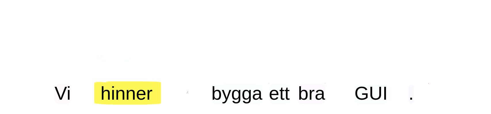

## Who
- PhD student in Natural Language Processing (or Computational Linguistics, or Language Technology...)  <!--most of you know me from lab sessions/tutorial classes, but outside of this course...--> at Språkbanken Text, GU
- particularly interested in:
  - computational syntax
  - Computer-Assisted Language Learning <!--so today we're gonna do both!--> \pause
  - Swedish <!--as a learner-->

## What
We are going to build a mini Python application to practice Swedish syntax (adverb placement)<!--and the reason why I chose this is a bit autobiographical, because I often misplace adverbs myself-->, but...

\bigskip

\footnotesize \centering "We don't have time to build a proper GUI"

## How
With __Part-Of-Speech annotation__ and __dependency parsing__:

<!--here I could talk a lot but I will only give you the basics, also because this is not the annotation format I am most used to. The things in the colorful blobs are POS tags, for instance... and the arrows indicate relations between words. They are also labelled, but we don't care-->

## How
With __Part-Of-Speech annotation__ and __dependency parsing__:

<!--actually we can disregard most things. Just remember AB = adverb, in this case referred to or modifying the verb "hinner"-->

## How
<!--so we take away the adverb, highlight the word they are referred to and ask the learner to place them in the correct spot-->
With __Part-Of-Speech annotation__ and __dependency parsing__:

## How
With __Part-Of-Speech annotation__ and __dependency parsing__:

## How
With __Part-Of-Speech annotation__ and __dependency parsing__:

## Libraries
<!--one of my favorite things about Python (and one of the reasons it became the lingua franca not only of NLP but of AI and ML in general) is that there is a library for every single thing-->
- [__python-korp__](https://github.com/mikahama/python-korp), a wrapper for the [Korp](https://spraakbanken.gu.se/korp/) API, to retrieve linguistically pre-annotated sentences from large Swedish corpora
- [__Spacy__](https://spacy.io/), a widely used NLP library, to annotate our own sentences

# Korp <!-- - Korp tour (incl. utökade queries) - Korp API - Korp notebook - basic app building - Spacy notebook - Spacy adaptation-->

## A basic application with Korp
1. get a random concordance containing an adverb
2. generate a question:
   1. set aside the adverb
   2. highlight its head <!--aka the word it is referred to-->
3. ask the user to input a 3+ word-long sequence _including_ the adverb <!--the idea is inputting surrounding words too, could be improved for beginning/end-->
4. check whether the sequence is included in the original sentence 

# Spacy

## Extending the application

__If the path to a custom input file is provided__:

1. __read the file and split it into sentences__ (we can assume that there is one sentence per line)
2. __parse all sentences with Spacy__
3. get a random concordance containing an adverb (__new query and matching function!__)
4. __transform it to a korp-like dict with `to_korp_dict`__

Otherwise:

1. get a random Korp concordance containing an adverb

Then, generate a question and check the user answer as usual.

## In conclusion
2h-prototype of a simple language learning app:

- code: [`github.com/harisont/advpy_nlp`](https://github.com/harisont/advpy_nlp)
- possible extensions:
  - GUI
  - other POS/dependency relations (customizable queries)
  - other languages (with Universal Dependencies)
  - ...

## To learn more
- Korp user manual: [`spraakbanken.gu.se/en/tools/korp/user-manual`](https://spraakbanken.gu.se/en/tools/korp/user-manual)
- Official Spacy website: [`spacy.io`](https://spacy.io/)
- the code: [`github.com/harisont/advpy_nlp`](https://github.com/harisont/advpy_nlp)
- the exercise class tomorrow <!--show pdf of the exercise-->
- <!--and last but not least-->Aarne's Computational Syntax course